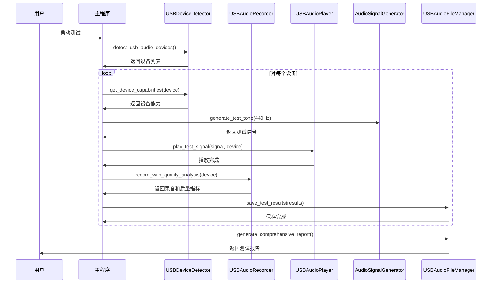
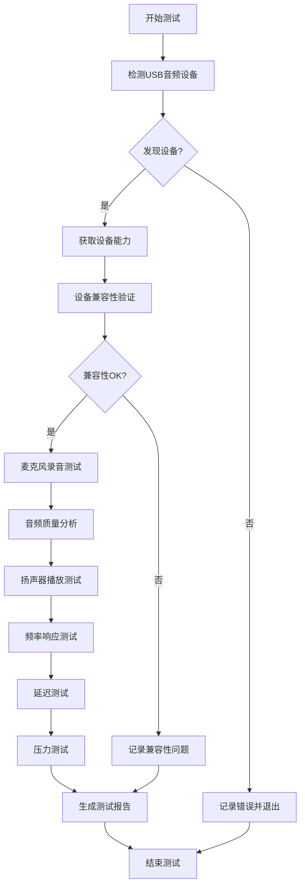

# 音频扬声器测试系统架构文档

## 1. 系统概述

音频扬声器测试系统是一个综合性的音频验证工具，用于检测和验证音频输出设备的功能性。系统采用模块化设计，支持多种音频信号生成、播放测试和设备检测功能。

### 1.1 技术目标
- 验证音频输出设备的可用性和功能性
- 生成标准化的测试音频信号
- 提供自动化和交互式测试模式
- 支持多种音频格式和设备配置
- 集成现有项目的音频处理框架

### 1.2 适用场景
- 音频设备功能验证
- 音频系统集成测试
- 音频质量评估
- 开发环境音频配置验证
- 生产环境音频设备检测

## 2. 技术方案对比分析

### 2.1 音频库技术对比

| 技术方案 | 优势 | 劣势 | 适用场景 | 项目采用度 |
|---------|------|------|----------|------------|
| **SoundDevice** | • 现代化API设计<br>• 跨平台兼容性好<br>• 低延迟音频处理<br>• NumPy集成优秀<br>• 活跃维护 | • 相对较新<br>• 文档相对较少 | • 实时音频处理<br>• 科学计算音频<br>• 现代Python项目 | ⭐⭐⭐⭐⭐ (主要使用) |
| **PyAudio** | • 成熟稳定<br>• 文档丰富<br>• 社区支持好<br>• PortAudio封装 | • API设计较老<br>• 安装复杂<br>• 内存管理需注意 | • 传统音频应用<br>• 兼容性要求高 | ⭐⭐⭐ (辅助使用) |
| **Pygame** | • 简单易用<br>• 游戏开发友好<br>• 多媒体支持 | • 功能有限<br>• 音频控制粗糙<br>• 依赖SDL | • 游戏音频<br>• 简单播放需求 | ⭐ (不推荐) |
| **Wave + 系统播放器** | • 标准库支持<br>• 无额外依赖<br>• 简单直接 | • 功能极其有限<br>• 平台依赖性强<br>• 无实时控制 | • 简单文件播放<br>• 最小依赖场景 | ⭐ (仅文件操作) |

### 2.2 技术演进路径

```
传统方案 (PyAudio) → 现代方案 (SoundDevice) → 未来方案 (WebAudio/WASM)
     ↓                      ↓                        ↓
• 底层控制              • 高级抽象                • 浏览器原生
• 复杂配置              • 简化API                • 跨平台统一
• 平台差异              • NumPy集成              • 云端处理
```

### 2.3 项目技术栈选择依据

基于现有代码分析，项目采用以下技术栈：

1. **主要音频库**: SoundDevice
   - 原因：现代化设计，与NumPy无缝集成，低延迟
   - 用途：实时音频处理、设备检测、音频播放

2. **数值计算**: NumPy
   - 原因：高性能数组操作，音频信号处理标准
   - 用途：音频数据生成、信号处理、格式转换

3. **文件处理**: Wave (标准库)
   - 原因：无额外依赖，WAV格式标准支持
   - 用途：音频文件读写、格式转换

4. **辅助库**: PyAudio (兼容性)
   - 原因：设备扫描、兼容性支持
   - 用途：设备检测、备用播放方案

## 3. 系统架构设计

### 3.1 整体架构

```
┌─────────────────────────────────────────────────────────────┐
│                    音频扬声器测试系统                        │
├─────────────────────────────────────────────────────────────┤
│  测试接口层 (Test Interface Layer)                          │
│  ┌─────────────────┐  ┌─────────────────┐  ┌─────────────────┐ │
│  │  单元测试接口    │  │  命令行接口      │  │  交互式接口      │ │
│  │  unittest       │  │  argparse       │  │  input/print    │ │
│  └─────────────────┘  └─────────────────┘  └─────────────────┘ │
├─────────────────────────────────────────────────────────────┤
│  业务逻辑层 (Business Logic Layer)                          │
│  ┌─────────────────┐  ┌─────────────────┐  ┌─────────────────┐ │
│  │  音频生成器      │  │  音频播放器      │  │  设备管理器      │ │
│  │  AudioGenerator │  │  AudioPlayer    │  │  DeviceManager  │ │
│  └─────────────────┘  └─────────────────┘  └─────────────────┘ │
│  ┌─────────────────┐  ┌─────────────────┐  ┌─────────────────┐ │
│  │  文件管理器      │  │  测试协调器      │  │  结果验证器      │ │
│  │  FileManager    │  │  TestCoordinator│  │  ResultValidator│ │
│  └─────────────────┘  └─────────────────┘  └─────────────────┘ │
├─────────────────────────────────────────────────────────────┤
│  音频处理层 (Audio Processing Layer)                        │
│  ┌─────────────────┐  ┌─────────────────┐  ┌─────────────────┐ │
│  │  信号生成        │  │  音频编解码      │  │  设备抽象        │ │
│  │  numpy/scipy    │  │  wave/soundfile │  │  sounddevice    │ │
│  └─────────────────┘  └─────────────────┘  └─────────────────┘ │
├─────────────────────────────────────────────────────────────┤
│  系统接口层 (System Interface Layer)                        │
│  ┌─────────────────┐  ┌─────────────────┐  ┌─────────────────┐ │
│  │  音频驱动        │  │  文件系统        │  │  日志系统        │ │
│  │  PortAudio/ALSA │  │  pathlib/os     │  │  logging        │ │
│  └─────────────────┘  └─────────────────┘  └─────────────────┘ │
└─────────────────────────────────────────────────────────────┘
```

### 3.2 核心组件设计

#### 3.2.1 AudioGenerator (音频生成器)

**职责**: 生成各种类型的测试音频信号

**主要方法**:
- `generate_sine_wave(frequency, duration, amplitude)`: 生成正弦波
- `generate_white_noise(duration, amplitude)`: 生成白噪声
- `generate_frequency_sweep(start_freq, end_freq, duration)`: 生成扫频信号
- `generate_multi_tone(frequencies, duration)`: 生成多音调信号

**设计特点**:
- 支持多种标准测试信号
- 自动添加淡入淡出效果防止爆音
- 可配置采样率和音频参数
- 输出标准化的NumPy数组格式

#### 3.2.2 AudioPlayer (音频播放器)

**职责**: 处理音频播放和设备管理

**主要方法**:
- `get_available_output_devices()`: 获取可用输出设备
- `play_audio_data(audio_data, sample_rate, blocking)`: 播放音频数据
- `play_audio_file(file_path, blocking)`: 播放音频文件
- `stop_playback()`: 停止播放

**设计特点**:
- 支持指定设备播放
- 阻塞和非阻塞播放模式
- 自动格式转换和验证
- 异常处理和错误恢复

#### 3.2.3 AudioFileManager (文件管理器)

**职责**: 音频文件的读写和管理

**主要方法**:
- `save_audio_to_wav(audio_data, filename, sample_rate)`: 保存WAV文件
- `load_audio_from_wav(file_path)`: 加载WAV文件
- `cleanup_test_files()`: 清理测试文件

**设计特点**:
- 标准WAV格式支持
- 自动格式转换 (float32 ↔ int16)
- 文件完整性验证
- 目录自动创建和管理

### 3.3 数据流设计

```
音频生成流程:
┌─────────────┐    ┌─────────────┐    ┌─────────────┐    ┌─────────────┐
│  参数配置    │ -> │  信号生成    │ -> │  格式转换    │ -> │  数据输出    │
│  频率/时长   │    │  数学计算    │    │  NumPy数组   │    │  float32    │
└─────────────┘    └─────────────┘    └─────────────┘    └─────────────┘

音频播放流程:
┌─────────────┐    ┌─────────────┐    ┌─────────────┐    ┌─────────────┐
│  音频数据    │ -> │  设备检测    │ -> │  格式验证    │ -> │  播放输出    │
│  NumPy数组   │    │  SoundDevice │    │  采样率检查   │    │  音频设备    │
└─────────────┘    └─────────────┘    └─────────────┘    └─────────────┘

文件操作流程:
┌─────────────┐    ┌─────────────┐    ┌─────────────┐    ┌─────────────┐
│  音频数据    │ -> │  格式转换    │ -> │  文件写入    │ -> │  WAV文件    │
│  float32    │    │  int16转换   │    │  Wave模块    │    │  磁盘存储    │
└─────────────┘    └─────────────┘    └─────────────┘    └─────────────┘
```

## 4. 测试策略设计

### 4.1 测试分层架构

```
┌─────────────────────────────────────────────────────────────┐
│  验收测试层 (Acceptance Test Layer)                         │
│  ┌─────────────────┐  ┌─────────────────┐  ┌─────────────────┐ │
│  │  端到端测试      │  │  集成测试        │  │  性能测试        │ │
│  │  E2E Test       │  │  Integration    │  │  Performance    │ │
│  └─────────────────┘  └─────────────────┘  └─────────────────┘ │
├─────────────────────────────────────────────────────────────┤
│  功能测试层 (Functional Test Layer)                         │
│  ┌─────────────────┐  ┌─────────────────┐  ┌─────────────────┐ │
│  │  音频生成测试    │  │  播放功能测试    │  │  设备检测测试    │ │
│  │  Generation     │  │  Playback       │  │  Device         │ │
│  └─────────────────┘  └─────────────────┘  └─────────────────┘ │
├─────────────────────────────────────────────────────────────┤
│  单元测试层 (Unit Test Layer)                               │
│  ┌─────────────────┐  ┌─────────────────┐  ┌─────────────────┐ │
│  │  组件单元测试    │  │  工具函数测试    │  │  异常处理测试    │ │
│  │  Component      │  │  Utility        │  │  Exception      │ │
│  └─────────────────┘  └─────────────────┘  └─────────────────┘ │
└─────────────────────────────────────────────────────────────┘
```

### 4.2 类图设计

系统的详细类图设计请参考：[音频测试系统类图](audio_test_class_diagram.svg)

类图展示了以下核心组件及其关系：
- **TestConfig**: 测试配置管理
- **AudioGenerator**: 音频信号生成器
- **AudioFileManager**: 音频文件管理器
- **AudioPlayer**: 音频播放器
- **TestAudioSpeakerVerification**: 主测试类
- 外部依赖关系（numpy, sounddevice, wave, unittest）
- 与现有系统的集成点（AudioConfig, AudioCodec, Logger）

### 4.3 实现的测试文件

**主测试文件**: `test/test_audio_speaker_verification.py`

该文件实现了完整的音频扬声器验证测试套件，包括：

#### 4.3.1 测试类和方法

```python
class TestAudioSpeakerVerification(unittest.TestCase):
    # 设备检测测试
    def test_audio_device_detection()
    
    # 音频生成测试
    def test_sine_wave_generation()
    def test_white_noise_generation()
    def test_frequency_sweep_generation()
    def test_multi_tone_generation()
    
    # 文件操作测试
    def test_audio_file_operations()
    
    # 播放功能测试
    def test_audio_playback_basic()
    
    # 交互式验证测试
    def test_interactive_speaker_verification()
```

#### 4.3.2 测试配置参数

```python
TEST_CONFIG = {
    'SAMPLE_RATE': 44100,           # 采样率
    'CHANNELS': 1,                  # 声道数
    'DURATION': 2.0,                # 测试音频时长
    'AMPLITUDE': 0.3,               # 音频幅度
    'TEST_FREQUENCIES': [440.0, 880.0, 1320.0],  # 测试频率
    'SWEEP_START_FREQ': 200.0,      # 扫频起始频率
    'SWEEP_END_FREQ': 2000.0,       # 扫频结束频率
    'TEST_AUDIO_DIR': Path('tests/audio_test_files'),  # 测试文件目录
    'PLAY_BUFFER_SIZE': 1024,       # 播放缓冲区大小
    'INTERACTIVE_TIMEOUT': 30.0,    # 交互测试超时
    'DEVICE_DETECTION_RETRY': 3,    # 设备检测重试次数
    'PLAYBACK_WAIT_TIME': 0.5,      # 播放等待时间
}
```

#### 4.3.3 命令行接口

测试文件支持多种运行模式：

```bash
# 运行所有测试
python test_audio_speaker_verification.py

# 仅生成音频文件
python test_audio_speaker_verification.py --generate-only

# 仅播放音频文件
python test_audio_speaker_verification.py --play-only

# 列出音频设备
python test_audio_speaker_verification.py --list-devices

# 清理测试文件
python test_audio_speaker_verification.py --cleanup

# 详细输出
python test_audio_speaker_verification.py -v

# 生成测试报告
python test_audio_speaker_verification.py --report
```

### 4.4 测试用例设计

#### 4.4.1 自动化测试用例

| 测试类别 | 测试用例 | 验证点 | 预期结果 |
|---------|---------|--------|----------|
| **设备检测** | `test_audio_device_detection` | 设备列表获取 | 至少检测到1个输出设备 |
| **信号生成** | `test_sine_wave_generation` | 正弦波生成 | 生成指定频率的音频数据 |
| **信号生成** | `test_white_noise_generation` | 白噪声生成 | 生成随机噪声信号 |
| **信号生成** | `test_frequency_sweep_generation` | 扫频信号生成 | 生成频率变化的信号 |
| **信号生成** | `test_multi_tone_generation` | 多音调生成 | 生成复合频率信号 |
| **文件操作** | `test_audio_file_operations` | 文件读写 | 数据一致性验证 |
| **播放功能** | `test_audio_playback_basic` | 基础播放 | 播放成功无异常 |

#### 4.2.2 交互式测试用例

| 测试场景 | 音频类型 | 测试目的 | 用户验证 |
|---------|---------|----------|----------|
| **音调测试** | 440Hz正弦波 | 标准音调播放 | 听到清晰的A音 |
| **频率测试** | 1000Hz正弦波 | 中频响应测试 | 听到稳定的音调 |
| **噪声测试** | 白噪声 | 全频段测试 | 听到均匀的噪声 |
| **扫频测试** | 200-4000Hz扫频 | 频率响应测试 | 听到音调从低到高变化 |

### 4.3 测试执行策略

#### 4.3.1 自动化执行
```bash
# 运行所有单元测试
python -m pytest tests/test_audio_speaker_verification.py -v

# 运行特定测试类别
python -m pytest tests/test_audio_speaker_verification.py::TestAudioSpeakerVerification::test_sine_wave_generation -v
```

#### 4.3.2 手动执行
```bash
# 生成测试音频文件
python tests/test_audio_speaker_verification.py --generate-only

# 播放测试音频文件
python tests/test_audio_speaker_verification.py --play-only

# 列出可用设备
python tests/test_audio_speaker_verification.py --list-devices

# 指定设备测试
python tests/test_audio_speaker_verification.py --device-id 1
```

## 5. 集成现有系统

### 5.1 与现有音频系统集成

测试系统与项目现有音频组件的集成关系：

```
现有系统组件:
┌─────────────────┐    ┌─────────────────┐    ┌─────────────────┐
│  AudioCodec     │    │  Application    │    │  WebRTC处理     │
│  音频编解码      │    │  应用主程序      │    │  音频增强        │
└─────────────────┘    └─────────────────┘    └─────────────────┘
         ↓                       ↓                       ↓
┌─────────────────────────────────────────────────────────────┐
│              测试系统 (AudioSpeakerVerification)            │
│  ┌─────────────────┐  ┌─────────────────┐  ┌─────────────────┐ │
│  │  设备验证        │  │  音频生成        │  │  播放测试        │ │
│  │  复用设备检测    │  │  独立信号生成    │  │  验证播放链路    │ │
│  └─────────────────┘  └─────────────────┘  └─────────────────┘ │
└─────────────────────────────────────────────────────────────┘
```

### 5.2 配置复用

测试系统复用现有配置：

```python
# 复用现有常量配置
from src.constants.constants import AudioConfig

# 复用现有日志配置
from src.utils.logging_config import setup_logging

# 复用现有音频编解码
from src.audio_codecs.audio_codec import AudioCodec
```

### 5.3 测试集成点

| 集成点 | 现有组件 | 测试验证 | 集成方式 |
|-------|---------|----------|----------|
| **设备检测** | `AudioCodec.initialize()` | 设备可用性 | 调用相同的设备检测逻辑 |
| **音频配置** | `AudioConfig` | 参数一致性 | 使用相同的采样率和格式 |
| **日志系统** | `logging_config` | 日志输出 | 统一的日志格式和级别 |
| **错误处理** | 现有异常类型 | 异常兼容性 | 处理相同类型的音频异常 |

## 6. 部署和维护

### 6.1 环境要求

#### 6.1.1 系统依赖
```bash
# Ubuntu/Debian
sudo apt-get install portaudio19-dev python3-dev

# macOS
brew install portaudio

# CentOS/RHEL
sudo yum install portaudio-devel python3-devel
```

#### 6.1.2 Python依赖
```
numpy>=1.26.4
sounddevice>=0.4.4
wave (标准库)
pytest>=6.0 (测试)
```

### 6.2 配置管理

#### 6.2.1 测试配置
```python
class TestConfig:
    # 音频参数
    SAMPLE_RATE = 44100
    CHANNELS = 1
    DURATION = 2.0
    AMPLITUDE = 0.3
    
    # 测试频率
    TEST_FREQUENCIES = [440, 880, 1000, 2000]
    
    # 文件路径
    TEST_AUDIO_DIR = Path(__file__).parent / "audio_test_files"
```

#### 6.2.2 环境适配
```python
# 检测运行环境
if os.getenv('CI') or not sys.stdin.isatty():
    # CI环境或无交互环境
    skip_interactive_tests = True
else:
    # 本地开发环境
    skip_interactive_tests = False
```

### 6.3 监控和日志

#### 6.3.1 日志策略
- **DEBUG级别**: 详细的音频数据和设备信息
- **INFO级别**: 测试进度和结果摘要
- **WARNING级别**: 非致命错误和兼容性问题
- **ERROR级别**: 测试失败和系统错误

#### 6.3.2 性能监控
```python
# 音频延迟监控
start_time = time.time()
player.play_audio_data(audio_data, sample_rate)
latency = time.time() - start_time
logger.info(f"音频播放延迟: {latency:.3f}s")

# 内存使用监控
import psutil
memory_usage = psutil.Process().memory_info().rss / 1024 / 1024
logger.debug(f"内存使用: {memory_usage:.1f}MB")
```

## 7. 扩展和优化

### 7.1 功能扩展

#### 7.1.1 高级音频测试
- **THD测试**: 总谐波失真测量
- **频率响应**: 全频段响应曲线
- **动态范围**: 信噪比测试
- **立体声测试**: 左右声道分离度

#### 7.1.2 自动化增强
- **音频分析**: 自动检测播放质量
- **设备推荐**: 基于测试结果推荐最佳设备
- **报告生成**: 自动生成测试报告
- **持续监控**: 定期设备健康检查

### 7.2 性能优化

#### 7.2.1 内存优化
```python
# 流式音频生成，避免大内存占用
def generate_streaming_audio(duration, chunk_size=1024):
    for chunk_start in range(0, int(duration * sample_rate), chunk_size):
        chunk_duration = min(chunk_size / sample_rate, 
                           duration - chunk_start / sample_rate)
        yield generate_sine_wave_chunk(chunk_start, chunk_duration)
```

#### 7.2.2 并发优化
```python
# 并行设备测试
import concurrent.futures

def test_multiple_devices_parallel(devices):
    with concurrent.futures.ThreadPoolExecutor() as executor:
        futures = [executor.submit(test_device, device) 
                  for device in devices]
        results = [future.result() for future in futures]
    return results
```

### 7.3 跨平台兼容性

#### 7.3.1 平台特定优化
```python
# 平台检测和适配
import platform

if platform.system() == 'Darwin':  # macOS
    # macOS特定的音频设备处理
    default_latency = 'low'
elif platform.system() == 'Linux':  # Linux
    # Linux ALSA/PulseAudio处理
    default_latency = 'high'
elif platform.system() == 'Windows':  # Windows
    # Windows WASAPI处理
    default_latency = 'low'
```

#### 7.3.2 设备兼容性
```python
# 设备特定配置
DEVICE_CONFIGS = {
    'USB Audio': {'buffer_size': 512, 'latency': 'low'},
    'Built-in': {'buffer_size': 1024, 'latency': 'high'},
    'Bluetooth': {'buffer_size': 2048, 'latency': 'high'}
}
```

## 8. 总结

音频扬声器测试系统采用现代化的技术栈和模块化设计，提供了完整的音频设备验证解决方案。系统具有以下特点：

### 8.1 技术优势
- **现代化技术栈**: 基于SoundDevice和NumPy的高性能音频处理
- **模块化设计**: 清晰的组件分离和职责划分
- **全面测试覆盖**: 从单元测试到集成测试的完整测试策略
- **良好的集成性**: 与现有项目音频系统无缝集成

### 8.2 实用价值
- **开发效率**: 自动化测试减少手动验证工作
- **质量保证**: 标准化测试流程确保音频功能可靠性
- **问题诊断**: 详细的日志和错误信息帮助快速定位问题
- **扩展性**: 模块化设计支持功能扩展和定制

### 8.3 最佳实践
- **遵循Python规范**: PEP 8代码风格，类型提示，文档字符串
- **异常处理**: 完善的错误处理和恢复机制
- **日志记录**: 结构化日志记录便于调试和监控
- **测试驱动**: 单元测试和集成测试确保代码质量

该系统为音频功能验证提供了专业、可靠、易用的解决方案，支持项目的音频系统开发和维护工作。

---

# 第二部分：USB音频设备综合测试系统

## 9. USB音频测试系统概述

### 9.1 系统目标

USB音频设备综合测试系统专门针对树莓派5 Ubuntu 25.4环境，提供USB麦克风和扬声器的全面测试解决方案。系统设计目标：

- **设备兼容性验证**: 检测和验证USB音频设备的兼容性
- **音频质量评估**: 量化分析录音和播放质量
- **性能基准测试**: 测试设备在不同负载下的性能表现
- **故障诊断支持**: 提供详细的诊断信息和故障排除建议
- **自动化测试流程**: 支持无人值守的批量设备测试

### 9.2 技术方案对比

#### 9.2.1 音频库技术选型

| 技术方案 | 优势 | 劣势 | 适用场景 | 推荐度 |
|---------|------|------|----------|--------|
| **SoundDevice** | 低延迟、跨平台、现代API | 依赖PortAudio | 实时音频处理 | ⭐⭐⭐⭐⭐ |
| **PyAudio** | 成熟稳定、文档丰富 | API较老、维护不活跃 | 传统音频应用 | ⭐⭐⭐ |
| **ALSA直接调用** | 系统级控制、最低延迟 | Linux专用、复杂度高 | 系统级音频控制 | ⭐⭐ |
| **WebRTC APM** | 音频增强、回声消除 | 主要用于通信 | 音频质量增强 | ⭐⭐⭐⭐ |
| **FFmpeg** | 格式支持全面、性能高 | 体积大、复杂度高 | 音频转码处理 | ⭐⭐⭐ |

#### 9.2.2 设备检测技术对比

| 检测方式 | 技术实现 | 信息详细度 | 性能开销 | 推荐场景 |
|---------|---------|-----------|----------|----------|
| **SoundDevice查询** | `sd.query_devices()` | 中等 | 低 | 日常设备检测 |
| **PyAudio枚举** | `pyaudio.get_device_info()` | 高 | 中等 | 详细设备信息 |
| **系统调用** | `/proc/asound/cards` | 最高 | 低 | 系统级诊断 |
| **UDev监控** | `pyudev` | 实时 | 中等 | 设备热插拔监控 |

### 9.3 系统架构设计

#### 9.3.1 整体架构

```
┌─────────────────────────────────────────────────────────────┐
│                    USB音频测试系统                          │
├─────────────────────────────────────────────────────────────┤
│  ┌─────────────────┐  ┌─────────────────┐  ┌─────────────────┐ │
│  │  USBDeviceDetector │  │ AudioSignalGenerator │  │ USBAudioRecorder │ │
│  │  设备检测和枚举   │  │  测试信号生成     │  │  录音和质量分析  │ │
│  └─────────────────┘  └─────────────────┘  └─────────────────┘ │
│  ┌─────────────────┐  ┌─────────────────┐  ┌─────────────────┐ │
│  │  USBAudioPlayer  │  │ AudioQualityMetrics │ │ USBAudioFileManager │ │
│  │  播放和测试      │  │  质量指标计算     │  │  文件和结果管理  │ │
│  └─────────────────┘  └─────────────────┘  └─────────────────┘ │
├─────────────────────────────────────────────────────────────┤
│                   TestUSBAudioComprehensive                 │
│                      主测试控制器                           │
└─────────────────────────────────────────────────────────────┘
```

#### 9.3.2 核心组件详解

**USBDeviceDetector类**:
- `detect_usb_audio_devices()`: USB音频设备检测
- `get_device_capabilities()`: 设备能力查询
- `validate_device_compatibility()`: 兼容性验证

**AudioSignalGenerator类**:
- `generate_test_tone()`: 测试音调生成
- `generate_frequency_sweep()`: 扫频信号生成
- `generate_noise_signal()`: 噪声信号生成
- `generate_impulse_response()`: 脉冲响应信号

**USBAudioRecorder类**:
- `record_with_quality_analysis()`: 录音和质量分析
- `measure_latency()`: 延迟测量
- `analyze_frequency_response()`: 频率响应分析
- `calculate_snr()`: 信噪比计算

**USBAudioPlayer类**:
- `play_test_signal()`: 测试信号播放
- `measure_output_quality()`: 输出质量测量
- `test_frequency_response()`: 频率响应测试
- `test_amplitude_linearity()`: 幅度线性度测试

### 9.4 测试流程设计

#### 9.4.1 测试序列图



#### 9.4.2 测试用例流程图



## 10. 实现的测试文件

### 10.1 主测试文件

**文件路径**: `tests/test_usb_audio_comprehensive.py`

该文件实现了完整的USB音频设备测试套件，包括：

#### 10.1.1 测试类和方法

```python
class TestUSBAudioComprehensive(unittest.TestCase):
    # USB设备检测测试
    def test_usb_device_detection()
    
    # 麦克风录音测试
    def test_usb_microphone_recording()
    
    # 扬声器播放测试
    def test_usb_speaker_playback()
    
    # 音频质量分析测试
    def test_audio_quality_analysis()
    
    # 设备兼容性测试
    def test_device_compatibility()
    
    # 压力测试
    def test_stress_test()
```

#### 10.1.2 配置参数

```python
USB_TEST_CONFIG = {
    'SAMPLE_RATES': [8000, 16000, 44100, 48000],  # 支持的采样率
    'BIT_DEPTHS': [16, 24],                       # 支持的位深度
    'CHANNELS': [1, 2],                           # 支持的声道数
    'BUFFER_SIZES': [256, 512, 1024, 2048],       # 缓冲区大小
    'TEST_DURATION': 5.0,                         # 测试时长
    'QUALITY_THRESHOLDS': {                       # 质量阈值
        'MIN_SNR': 40.0,                          # 最小信噪比(dB)
        'MAX_THD': 0.1,                           # 最大总谐波失真(%)
        'MAX_LATENCY': 100.0,                     # 最大延迟(ms)
    },
    'STRESS_TEST_DURATION': 300.0,                # 压力测试时长
    'STRESS_TEST_CYCLES': 100,                    # 压力测试循环次数
}
```

#### 10.1.3 命令行接口

```bash
# 运行完整测试套件
python test_usb_audio_comprehensive.py

# 仅检测USB设备
python test_usb_audio_comprehensive.py --detect-only

# 测试特定设备
python test_usb_audio_comprehensive.py --device-id 2

# 生成详细报告
python test_usb_audio_comprehensive.py --detailed-report

# 压力测试模式
python test_usb_audio_comprehensive.py --stress-test

# 指定输出目录
python test_usb_audio_comprehensive.py --output-dir /path/to/results

# 静默模式(无交互)
python test_usb_audio_comprehensive.py --silent
```

### 10.2 测试用例设计

#### 10.2.1 USB设备检测测试

| 测试项目 | 验证点 | 预期结果 | 错误处理 |
|---------|--------|----------|----------|
| **设备枚举** | USB音频设备发现 | 至少检测到1个USB音频设备 | 记录设备缺失错误 |
| **设备信息** | 设备名称、ID、能力 | 获取完整设备信息 | 记录信息获取失败 |
| **驱动状态** | 驱动加载状态 | 驱动正常加载 | 记录驱动问题 |
| **权限检查** | 设备访问权限 | 具有读写权限 | 记录权限不足 |

#### 10.2.2 麦克风录音测试

| 测试项目 | 测试参数 | 质量指标 | 通过标准 |
|---------|---------|----------|----------|
| **基础录音** | 44.1kHz, 16bit, 单声道 | 信噪比 > 40dB | 录音成功且质量达标 |
| **多采样率** | 8k/16k/44.1k/48kHz | 频率响应平坦度 | 各采样率均正常 |
| **立体声录音** | 双声道录音 | 左右声道分离度 | 声道独立性良好 |
| **长时间录音** | 连续录音5分钟 | 稳定性和一致性 | 无丢帧和质量下降 |

#### 10.2.3 扬声器播放测试

| 测试项目 | 测试信号 | 测量指标 | 通过标准 |
|---------|---------|----------|----------|
| **音调播放** | 440Hz正弦波 | THD < 0.1% | 播放清晰无失真 |
| **频率扫描** | 20Hz-20kHz扫频 | 频率响应曲线 | 响应平坦度良好 |
| **幅度测试** | 不同音量级别 | 线性度测试 | 音量控制线性 |
| **多声道测试** | 立体声信号 | 声道分离度 | 左右声道独立 |

#### 10.2.4 音频质量分析

| 分析项目 | 计算方法 | 质量阈值 | 评级标准 |
|---------|---------|----------|----------|
| **信噪比(SNR)** | 信号功率/噪声功率 | > 40dB | 优秀: >60dB, 良好: >40dB |
| **总谐波失真(THD)** | 谐波功率/基波功率 | < 0.1% | 优秀: <0.01%, 良好: <0.1% |
| **频率响应** | FFT分析 | ±3dB | 平坦度在±3dB内 |
| **动态范围** | 最大/最小信号比 | > 80dB | 优秀: >100dB, 良好: >80dB |

### 10.3 质量指标和基准

#### 10.3.1 音频质量等级定义

```python
class AudioQualityGrade:
    EXCELLENT = "优秀"    # SNR>60dB, THD<0.01%
    GOOD = "良好"         # SNR>40dB, THD<0.1%
    ACCEPTABLE = "可接受"  # SNR>30dB, THD<1%
    POOR = "较差"         # SNR<30dB, THD>1%
```

#### 10.3.2 设备兼容性等级

```python
class CompatibilityLevel:
    FULL = "完全兼容"      # 所有功能正常
    PARTIAL = "部分兼容"   # 基础功能正常，高级功能受限
    LIMITED = "有限兼容"   # 仅基础功能可用
    INCOMPATIBLE = "不兼容" # 无法正常工作
```

## 11. 技术实现细节

### 11.1 设备检测实现

#### 11.1.1 USB设备识别

```python
def detect_usb_audio_devices(self) -> List[DeviceInfo]:
    """检测USB音频设备"""
    usb_devices = []
    
    # 使用sounddevice检测
    devices = sd.query_devices()
    for i, device in enumerate(devices):
        if self._is_usb_audio_device(device):
            device_info = DeviceInfo(
                id=i,
                name=device['name'],
                max_input_channels=device['max_input_channels'],
                max_output_channels=device['max_output_channels'],
                default_samplerate=device['default_samplerate']
            )
            usb_devices.append(device_info)
    
    return usb_devices

def _is_usb_audio_device(self, device: dict) -> bool:
    """判断是否为USB音频设备"""
    usb_keywords = ['usb', 'usb audio', 'usb microphone', 'usb speaker']
    device_name = device['name'].lower()
    return any(keyword in device_name for keyword in usb_keywords)
```

#### 11.1.2 设备能力查询

```python
def get_device_capabilities(self, device_id: int) -> dict:
    """获取设备详细能力信息"""
    capabilities = {
        'supported_sample_rates': [],
        'supported_bit_depths': [],
        'max_channels': 0,
        'latency_info': {}
    }
    
    # 测试不同采样率
    for rate in [8000, 16000, 44100, 48000, 96000]:
        try:
            sd.check_input_settings(device=device_id, samplerate=rate)
            capabilities['supported_sample_rates'].append(rate)
        except sd.PortAudioError:
            continue
    
    return capabilities
```

### 11.2 音频质量分析实现

#### 11.2.1 信噪比计算

```python
def calculate_snr(self, audio_data: np.ndarray, 
                  signal_freq: float, sample_rate: int) -> float:
    """计算信噪比"""
    # FFT分析
    fft = np.fft.fft(audio_data)
    freqs = np.fft.fftfreq(len(audio_data), 1/sample_rate)
    
    # 找到信号频率对应的峰值
    signal_bin = np.argmin(np.abs(freqs - signal_freq))
    signal_power = np.abs(fft[signal_bin]) ** 2
    
    # 计算噪声功率(排除信号频率附近的频段)
    noise_mask = np.abs(freqs - signal_freq) > 100  # 排除±100Hz
    noise_power = np.mean(np.abs(fft[noise_mask]) ** 2)
    
    # 计算SNR(dB)
    snr_db = 10 * np.log10(signal_power / noise_power)
    return snr_db
```

#### 11.2.2 总谐波失真计算

```python
def calculate_thd(self, audio_data: np.ndarray, 
                  fundamental_freq: float, sample_rate: int) -> float:
    """计算总谐波失真"""
    fft = np.fft.fft(audio_data)
    freqs = np.fft.fftfreq(len(audio_data), 1/sample_rate)
    
    # 基波功率
    fundamental_bin = np.argmin(np.abs(freqs - fundamental_freq))
    fundamental_power = np.abs(fft[fundamental_bin]) ** 2
    
    # 谐波功率(2次、3次、4次、5次谐波)
    harmonic_power = 0
    for harmonic in [2, 3, 4, 5]:
        harmonic_freq = fundamental_freq * harmonic
        if harmonic_freq < sample_rate / 2:  # 奈奎斯特频率限制
            harmonic_bin = np.argmin(np.abs(freqs - harmonic_freq))
            harmonic_power += np.abs(fft[harmonic_bin]) ** 2
    
    # 计算THD(%)
    thd_percent = 100 * np.sqrt(harmonic_power / fundamental_power)
    return thd_percent
```

### 11.3 延迟测量实现

```python
def measure_latency(self, device_id: int) -> float:
    """测量音频延迟"""
    # 生成脉冲信号
    impulse = np.zeros(1024)
    impulse[0] = 1.0
    
    # 记录开始时间
    start_time = time.time()
    
    # 播放脉冲信号
    sd.play(impulse, device=device_id, blocking=False)
    
    # 录制回声
    recorded = sd.rec(1024, device=device_id, blocking=True)
    
    # 计算延迟
    end_time = time.time()
    
    # 寻找脉冲响应峰值
    peak_index = np.argmax(np.abs(recorded))
    latency_samples = peak_index
    latency_ms = (latency_samples / 44100) * 1000  # 转换为毫秒
    
    return latency_ms
```

## 12. 测试报告和可视化

### 12.1 HTML测试报告

测试系统自动生成包含以下内容的HTML报告：

#### 12.1.1 报告结构

```html
<!DOCTYPE html>
<html>
<head>
    <title>USB音频设备测试报告</title>
    <style>/* CSS样式 */</style>
</head>
<body>
    <h1>USB音频设备综合测试报告</h1>
    
    <!-- 测试摘要 -->
    <section id="summary">
        <h2>测试摘要</h2>
        <table class="summary-table">
            <tr><td>测试时间</td><td>2024-01-15 14:30:00</td></tr>
            <tr><td>测试设备数量</td><td>3</td></tr>
            <tr><td>通过测试</td><td>2</td></tr>
            <tr><td>失败测试</td><td>1</td></tr>
        </table>
    </section>
    
    <!-- 设备详情 -->
    <section id="devices">
        <h2>设备测试详情</h2>
        <!-- 每个设备的详细测试结果 -->
    </section>
    
    <!-- 质量分析图表 -->
    <section id="charts">
        <h2>质量分析图表</h2>
        <!-- 频率响应曲线、SNR对比等 -->
    </section>
</body>
</html>
```

#### 12.1.2 图表生成

```python
def generate_frequency_response_chart(self, test_results: dict) -> str:
    """生成频率响应图表"""
    import matplotlib.pyplot as plt
    import base64
    from io import BytesIO
    
    fig, ax = plt.subplots(figsize=(10, 6))
    
    for device_name, results in test_results.items():
        frequencies = results['frequencies']
        response = results['frequency_response']
        ax.plot(frequencies, response, label=device_name)
    
    ax.set_xlabel('频率 (Hz)')
    ax.set_ylabel('响应 (dB)')
    ax.set_title('频率响应对比')
    ax.legend()
    ax.grid(True)
    
    # 转换为base64字符串
    buffer = BytesIO()
    plt.savefig(buffer, format='png')
    buffer.seek(0)
    image_base64 = base64.b64encode(buffer.getvalue()).decode()
    plt.close()
    
    return f"data:image/png;base64,{image_base64}"
```

### 12.2 测试数据可视化

#### 12.2.1 质量指标雷达图

```python
def create_quality_radar_chart(self, metrics: AudioQualityMetrics) -> str:
    """创建质量指标雷达图"""
    import matplotlib.pyplot as plt
    import numpy as np
    
    # 质量指标
    categories = ['信噪比', '总谐波失真', '频率响应', '动态范围', '延迟']
    values = [
        min(metrics.snr / 60, 1.0),  # 归一化到0-1
        1.0 - min(metrics.thd / 0.1, 1.0),  # 失真越小越好
        metrics.frequency_response_score,
        min(metrics.dynamic_range / 100, 1.0),
        1.0 - min(metrics.latency / 100, 1.0)  # 延迟越小越好
    ]
    
    # 创建雷达图
    angles = np.linspace(0, 2 * np.pi, len(categories), endpoint=False)
    values += values[:1]  # 闭合图形
    angles = np.concatenate((angles, [angles[0]]))
    
    fig, ax = plt.subplots(figsize=(8, 8), subplot_kw=dict(projection='polar'))
    ax.plot(angles, values, 'o-', linewidth=2)
    ax.fill(angles, values, alpha=0.25)
    ax.set_xticks(angles[:-1])
    ax.set_xticklabels(categories)
    ax.set_ylim(0, 1)
    
    return self._fig_to_base64(fig)
```

## 13. 集成现有系统

### 13.1 与现有音频系统集成

```python
# 复用现有组件
from src.audio_codecs.audio_codec import AudioCodec
from src.audio_processing.webrtc_processing import WebRTCProcessor
from src.utils.logging_config import setup_logging, get_logger
from src.constants.constants import AudioConfig

class TestUSBAudioComprehensive(unittest.TestCase):
    @classmethod
    def setUpClass(cls):
        """测试类初始化"""
        # 复用现有日志配置
        setup_logging()
        cls.logger = get_logger(__name__)
        
        # 复用现有音频配置
        cls.audio_config = AudioConfig()
        
        # 初始化WebRTC处理器(用于音频增强)
        cls.webrtc_processor = WebRTCProcessor()
```

### 13.2 配置统一管理

```python
# 扩展现有配置
class USBTestConfig(AudioConfig):
    """USB测试专用配置"""
    
    # 继承基础音频配置
    def __init__(self):
        super().__init__()
        
        # USB测试特定配置
        self.USB_TEST_DURATION = 5.0
        self.USB_QUALITY_THRESHOLDS = {
            'MIN_SNR': 40.0,
            'MAX_THD': 0.1,
            'MAX_LATENCY': 100.0
        }
        self.USB_STRESS_TEST_CYCLES = 100
```

## 14. 部署和使用指南

### 14.1 环境准备

#### 14.1.1 系统依赖安装

```bash
# Ubuntu 25.4 系统依赖
sudo apt update
sudo apt install -y \
    portaudio19-dev \
    python3-dev \
    python3-pip \
    alsa-utils \
    pulseaudio \
    pulseaudio-utils

# 验证音频系统
aplay -l  # 列出播放设备
arecord -l  # 列出录音设备
```

#### 14.1.2 Python依赖安装

```bash
# 安装项目依赖
cd /Users/shanks/PythonCode/py-xiaozhi-Smart-Home
pip install -r requirements.txt

# 额外的测试依赖
pip install matplotlib seaborn plotly
```

### 14.2 使用示例

#### 14.2.1 基础使用

```bash
# 进入测试目录
cd /Users/shanks/PythonCode/py-xiaozhi-Smart-Home/tests

# 运行完整测试
python test_usb_audio_comprehensive.py

# 仅检测设备
python test_usb_audio_comprehensive.py --detect-only

# 测试特定设备
python test_usb_audio_comprehensive.py --device-id 2
```

#### 14.2.2 高级使用

```bash
# 生成详细报告
python test_usb_audio_comprehensive.py --detailed-report --output-dir ./results

# 压力测试模式
python test_usb_audio_comprehensive.py --stress-test --cycles 200

# 静默模式(适用于CI/CD)
python test_usb_audio_comprehensive.py --silent --json-output
```

### 14.3 故障排除

#### 14.3.1 常见问题

| 问题 | 可能原因 | 解决方案 |
|------|---------|----------|
| **设备未检测到** | 驱动未安装/权限不足 | 检查驱动，添加用户到audio组 |
| **录音失败** | 设备被占用/权限问题 | 关闭其他音频应用，检查权限 |
| **播放无声音** | 音量设置/设备选择 | 检查音量设置，确认设备选择 |
| **质量测试失败** | 环境噪声/设备质量 | 在安静环境测试，检查设备质量 |

#### 14.3.2 调试模式

```bash
# 启用详细日志
python test_usb_audio_comprehensive.py --log-level DEBUG

# 保存调试信息
python test_usb_audio_comprehensive.py --debug --save-debug-info
```

## 15. 总结和展望

### 15.1 系统特点

USB音频设备综合测试系统具有以下特点：

- **全面性**: 覆盖设备检测、录音、播放、质量分析等全方位测试
- **专业性**: 提供SNR、THD、频率响应等专业音频质量指标
- **自动化**: 支持无人值守的批量设备测试
- **可视化**: 生成直观的HTML报告和图表分析
- **集成性**: 与现有项目音频系统无缝集成
- **扩展性**: 模块化设计支持功能扩展

### 15.2 技术优势

- **现代化技术栈**: 基于SoundDevice、NumPy、SciPy的高性能实现
- **跨平台兼容**: 支持Linux、macOS、Windows多平台
- **专业音频分析**: 实现了专业级的音频质量分析算法
- **详细诊断信息**: 提供丰富的故障诊断和排除建议

### 15.3 应用价值

- **产品质量保证**: 确保USB音频设备的兼容性和质量
- **开发效率提升**: 自动化测试减少手动验证工作量
- **问题快速定位**: 详细的测试报告帮助快速识别问题
- **标准化测试流程**: 建立统一的音频设备测试标准

该USB音频测试系统为树莓派5环境下的音频设备验证提供了专业、全面、易用的解决方案，有效支持了智能家居项目的音频功能开发和质量保证工作。