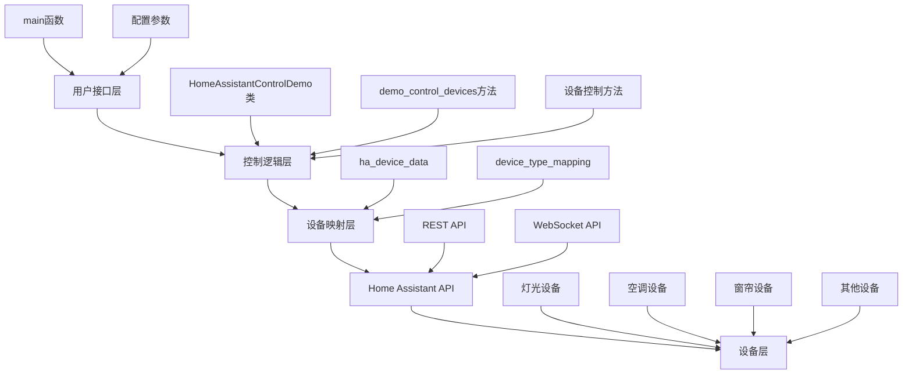
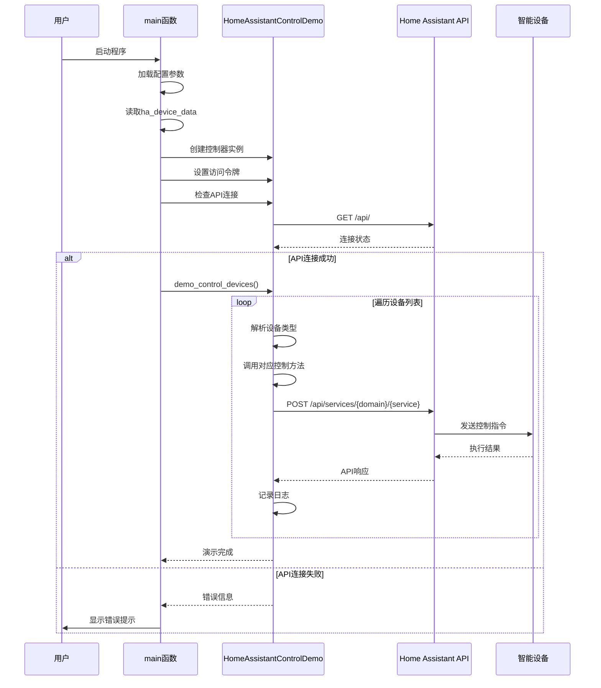
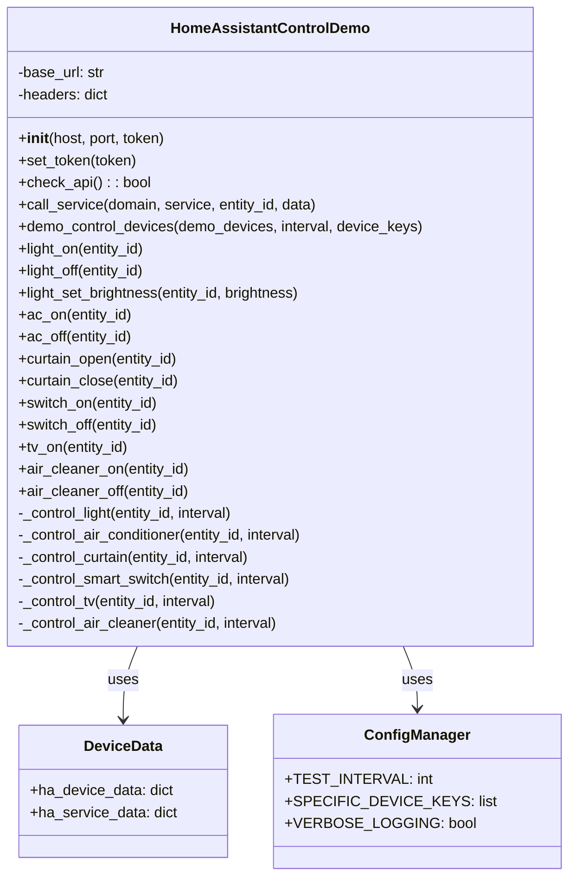

# 智能家居设备控制系统技术文档

## 1. 系统概述

本文档描述了智能家居设备控制系统的技术架构、实现方案和使用方法。该系统基于Home Assistant平台，提供统一的设备控制接口和测试框架。

### 1.1 核心功能
- 统一的设备数据管理
- 基于key值的设备映射系统
- 支持多种智能家居设备类型
- 完整的设备控制演示和测试框架
- 详细的日志记录和错误处理

### 1.2 支持的设备类型
| 设备类型 | Domain | 功能描述 |
|---------|--------|----------|
| 灯光 (light) | light | 开关、亮度调节、颜色设置 |
| 空调 (air_conditioner) | climate | 开关、温度设置、模式切换 |
| 窗帘 (curtain) | cover | 开启、关闭、停止 |
| 智能开关 (smart_switch) | switch | 开关控制 |
| 电视 (tv) | button | 按钮操作 |
| 空气净化器 (air_clean) | fan | 开关控制 |

## 2. 技术方案分析

### 2.1 市面上相关技术方案对比

#### 2.1.1 Home Assistant vs 其他平台

| 平台 | 优势 | 劣势 | 适用场景 |
|------|------|------|----------|
| **Home Assistant** | • 开源免费<br>• 支持设备广泛<br>• 本地化部署<br>• 社区活跃 | • 配置复杂<br>• 需要技术基础 | 技术用户、隐私要求高 |
| **小米米家** | • 生态完整<br>• 配置简单<br>• 价格便宜 | • 封闭生态<br>• 云端依赖<br>• 隐私担忧 | 普通用户、小米设备 |
| **Apple HomeKit** | • 隐私保护好<br>• 体验流畅<br>• 安全性高 | • 设备昂贵<br>• 生态封闭<br>• 设备选择少 | 苹果用户、高端需求 |
| **Amazon Alexa** | • 语音控制强<br>• 设备支持多<br>• 云服务稳定 | • 隐私担忧<br>• 网络依赖<br>• 本地化差 | 语音控制、海外用户 |

#### 2.1.2 技术架构选择

**选择Home Assistant的原因：**
1. **开放性**：支持多种协议和设备品牌
2. **可扩展性**：丰富的插件和集成
3. **本地化**：数据本地存储，响应速度快
4. **成本效益**：开源免费，硬件要求低
5. **技术演进**：持续更新，社区支持强

### 2.2 系统架构设计



### 2.3 数据流程图



### 2.4 类图设计



## 3. 实现细节

### 3.1 设备映射机制

系统采用两层映射机制：

1. **数据层映射** (`ha_device_data`)：
   ```python
   ha_device_data = {
       "air_clean": "fan.zhimi_cn_287827089_ma2_s_2_air_purifier",
       "light": "light.ftd_cn_1123337548_ftdlmp_s_2_light",
       # ...
   }
   ```

2. **类型层映射** (`device_type_mapping`)：
   ```python
   device_type_mapping = {
       'light': {'domain': 'light', 'friendly_name': '灯光'},
       'air_conditioner': {'domain': 'climate', 'friendly_name': '空调'},
       # ...
   }
   ```

### 3.2 错误处理机制

- **连接错误**：API连接失败时提供详细的排查指南
- **设备错误**：单个设备控制失败不影响其他设备
- **用户中断**：支持Ctrl+C优雅退出
- **异常捕获**：所有异常都有相应的错误信息

### 3.3 日志记录规范

系统遵循以下日志规范：
- 使用emoji图标增强可读性
- 分层级记录（信息、警告、错误）
- 包含关键数据（entity_id、domain等）
- 操作结果明确反馈

## 4. 配置说明

### 4.1 主要配置参数

```python
# 测试间隔时间(秒)
TEST_INTERVAL = 5

# 指定要测试的设备key列表
SPECIFIC_DEVICE_KEYS = None  # 或 ['air_clean', 'light']

# 是否启用详细日志
VERBOSE_LOGGING = True
```

### 4.2 设备配置

在 `ha_data.py` 中配置设备：
```python
ha_device_data = {
    "device_key": "domain.entity_id",
    # 例如：
    "light": "light.living_room_light",
}
```

## 5. 使用方法

### 5.1 基本使用

```bash
# 运行完整演示
python src/ha/home_assistant_command.py
```

### 5.2 自定义测试

```python
# 只测试特定设备
SPECIFIC_DEVICE_KEYS = ['air_clean', 'light']

# 调整测试间隔
TEST_INTERVAL = 3
```

### 5.3 编程接口

```python
from src.ha.home_assistant_command import HomeAssistantControlDemo
from src.ha.ha_data import ha_service_data, ha_device_data

# 创建控制器
demo = HomeAssistantControlDemo(
    ha_service_data["host"], 
    ha_service_data["port"]
)
demo.set_token(ha_service_data["token"])

# 控制特定设备
demo.demo_control_devices(
    demo_devices=ha_device_data,
    interval=5,
    device_keys=['light']  # 只测试灯光
)
```

## 6. 最佳实践

### 6.1 代码规范

本系统遵循以下Python代码规范：
- **PEP 8**：代码风格规范
- **类型提示**：函数参数和返回值类型
- **文档字符串**：详细的函数说明
- **异常处理**：完善的错误处理机制
- **日志记录**：结构化的日志输出

### 6.2 性能优化建议

1. **批量操作**：对于多设备操作，考虑并发执行
2. **缓存机制**：缓存设备状态减少API调用
3. **连接池**：复用HTTP连接提高效率
4. **超时设置**：设置合理的API超时时间

### 6.3 安全考虑

1. **令牌管理**：定期更新访问令牌
2. **网络安全**：使用HTTPS连接
3. **权限控制**：最小权限原则
4. **数据验证**：输入参数验证

## 7. 故障排除

### 7.1 常见问题

| 问题 | 原因 | 解决方案 |
|------|------|----------|
| API连接失败 | 网络问题或令牌无效 | 检查网络和令牌配置 |
| 设备控制无响应 | Entity ID错误 | 验证设备ID正确性 |
| 部分设备失效 | 设备离线或配置错误 | 检查设备状态和配置 |

### 7.2 调试方法

1. **启用详细日志**：设置 `VERBOSE_LOGGING = True`
2. **单设备测试**：使用 `SPECIFIC_DEVICE_KEYS` 测试单个设备
3. **API测试**：直接调用 `check_api()` 方法
4. **网络诊断**：检查Home Assistant服务状态

## 8. 扩展开发

### 8.1 添加新设备类型

1. 在 `device_type_mapping` 中添加设备类型
2. 实现对应的控制方法
3. 在 `demo_control_devices` 中添加处理逻辑
4. 更新文档和测试

### 8.2 集成其他平台

系统设计支持扩展到其他智能家居平台：
- 修改API调用层
- 保持设备映射层不变
- 适配不同的认证机制

## 9. 版本历史

| 版本 | 日期 | 更新内容 |
|------|------|----------|
| 1.0.0 | 2024-01 | 初始版本，基础设备控制功能 |
| 1.1.0 | 2024-01 | 添加设备映射系统和配置参数 |
| 1.2.0 | 2024-01 | 完善错误处理和日志记录 |

---

**文档维护者**：智能家居开发团队  
**最后更新**：2024年1月  
**文档版本**：1.2.0