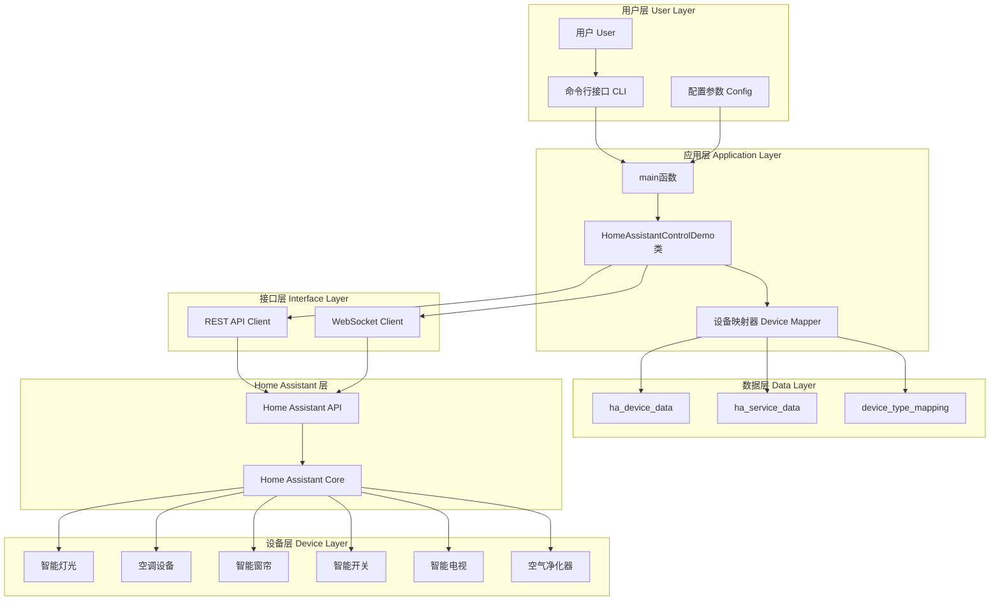
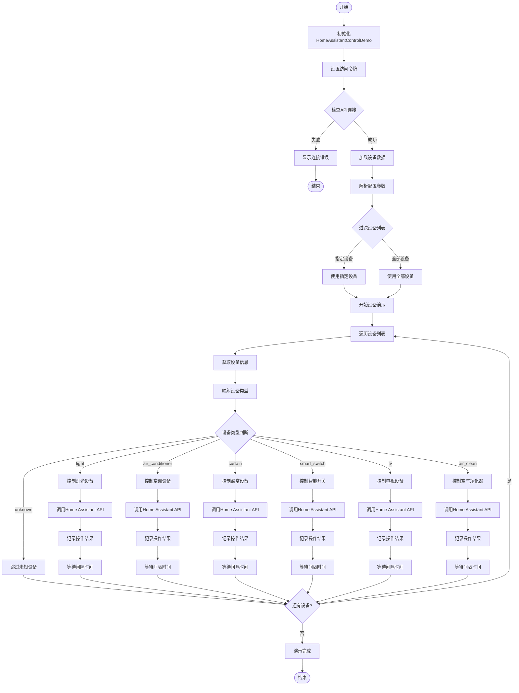
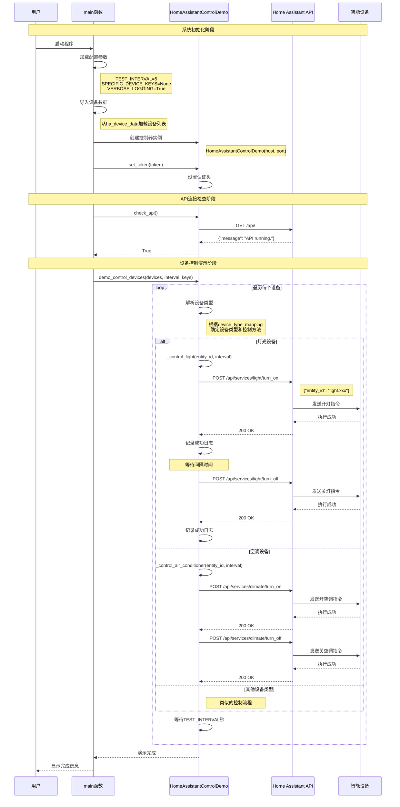
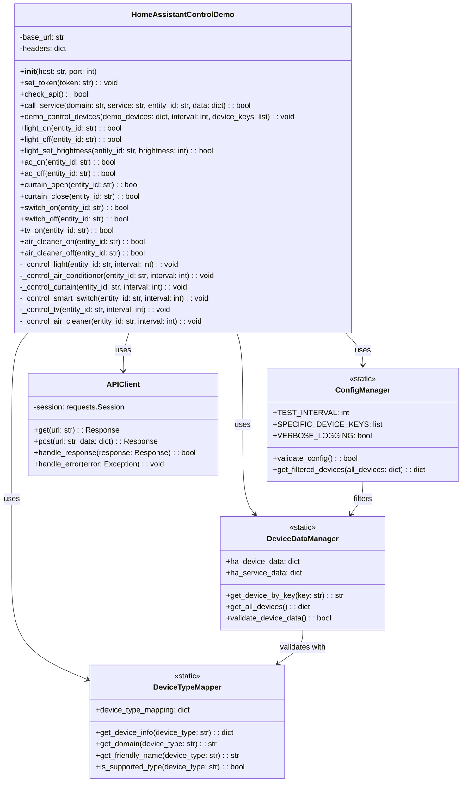
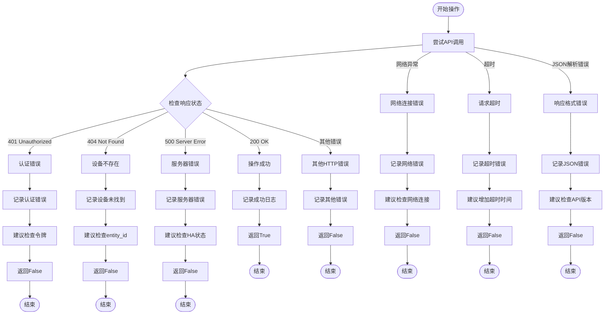
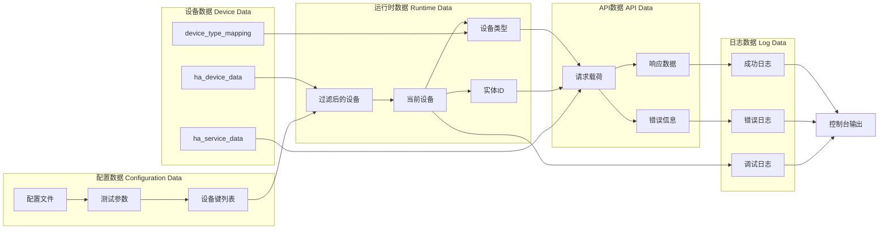
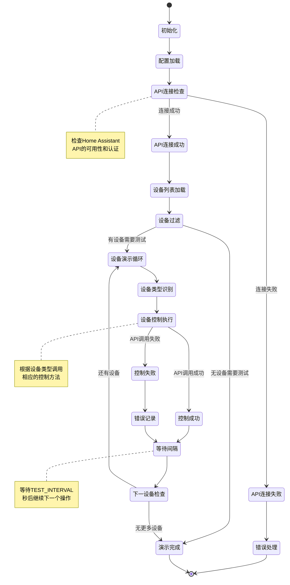
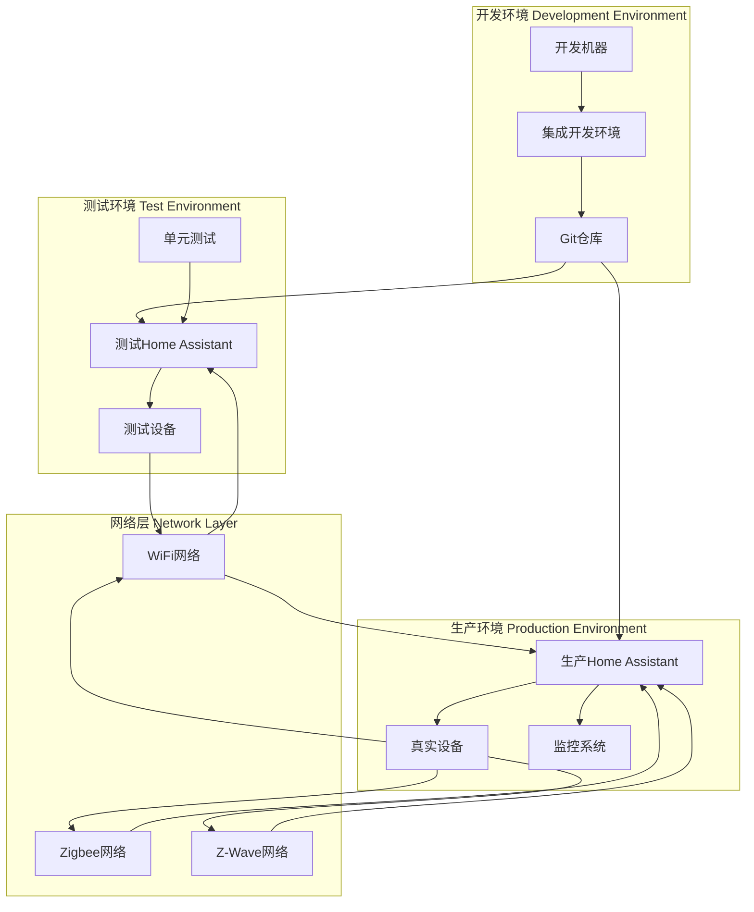

# 智能家居设备控制系统架构图

本文档包含系统的各种架构图和流程图，帮助理解系统设计和数据流向。

## 1. 系统整体架构图

## 2. 设备控制流程图

## 3. API调用时序图

## 4. 设备映射系统类图

## 5. 错误处理流程图

## 6. 数据流向图

## 7. 系统状态图

## 8. 部署架构图

---

**说明：**
- 所有图表使用Mermaid语法，可以在支持Mermaid的Markdown查看器中渲染
- 图表中包含了类名和方法名，便于快速定位代码
- 时序图详细展示了API调用的完整流程
- 错误处理流程图涵盖了各种异常情况的处理方式
- 状态图展示了系统的完整生命周期